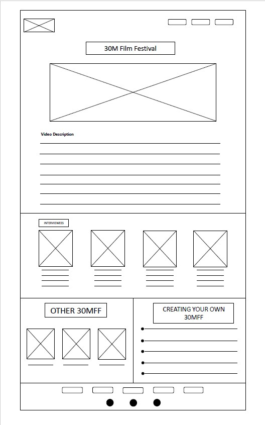
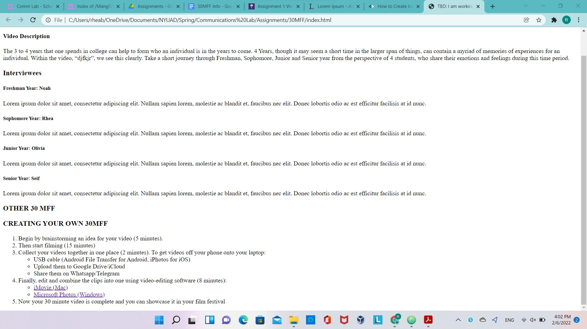
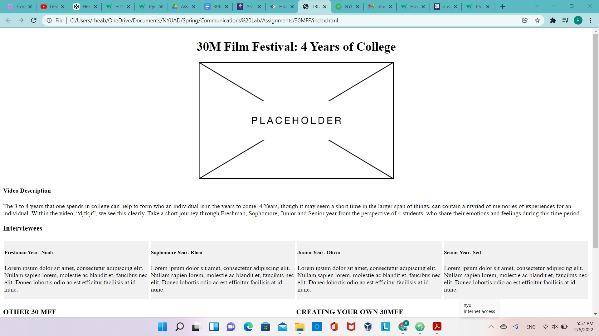

# Project Name: 4 Years of College

## Project Description: 

"4 Years of College" is a website that is centered around a 30 minute film that was created in my Communications Lab class with Professor Michael Ang. The overall concept is that of a video which acts a testimonial of how 4 students are feeling during their specific year of college. All four years are addressed, Frehsman, Sophomore, Junior and Senior year. And so, this website focuses on sharing this video with the user. I would say that the theme is minimalistic. The colour scheme is in grayscale and I tried to use a legible font, as well as divide up the website into its specific components, the video, the process, the participants as well as share how to create one's own 3 Minute Film and Film Festival. The experience that I am trying to create is one that is insightful, calming, and not very distracting. I did decide to use some colours, in order to draw the reader's attention to certain details, but not in a chaotic way.  

## The Process

I began the process by first drafting up my wireframe. The final product differs a bit from this concept, but I use Microsoft Powerpoint to come up with a basic template of what I wanted to do. 

Then I began adding the content of the page. At this point I was not really concerned about position or the overall aesthetic of the page, but simply the content that I wanted to add, and the user to see. 

Having some content, I decided focus on plaing the various components to mock the wireframe, and make any changes that I though necessary. It proved useful to add placeholder images of various sizes, which I could then replace with picutres and/or videos.

Process: How did you go about implementing the concept.

Reflection/Evaluation: This should bookend the initial concept and talk about whether your expectations and goals were met in the process of building the final working version.
